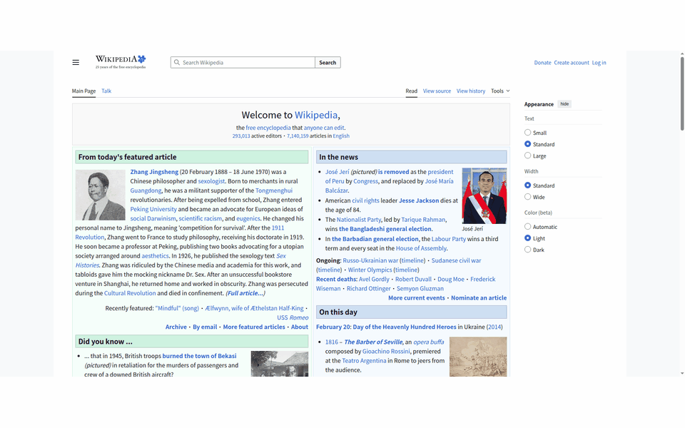
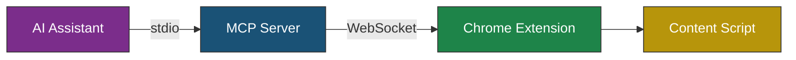

# WebClaw

[](https://github.com/kuroko1t/webclaw/actions/workflows/ci.yml)
[](https://www.npmjs.com/package/webclaw-mcp)
[](LICENSE)

A **WebMCP-native** browser agent that runs inside your real Chrome — control it from Claude, Cursor, and any MCP client.

<p align="center">
  
</p>

## Why WebClaw?

|  | WebClaw | browser-use | Playwright MCP |
|---|---|---|---|
| Runs in real Chrome | **Yes** (extension) | No (CDP) | No (Playwright) |
| User's logged-in sessions | **Yes** | No | No |
| Bot detection | **Resistant** | Vulnerable | Vulnerable |
| WebMCP native tools | **Yes** | No | No |
| Page understanding | `@ref` a11y tree | Screenshots | DOM / Screenshots |

WebClaw runs as a **Chrome extension**, so it sees exactly what you see — cookies, logins, extensions, and all. No headless browser, no CDP injection, no bot flags.

## Quick Start

### 1. Configure your MCP client

<details open>
<summary><b>Claude Desktop</b></summary>

Add to `claude_desktop_config.json`:

```json
{
  "mcpServers": {
    "webclaw": {
      "command": "npx",
      "args": ["-y", "webclaw-mcp"]
    }
  }
}
```

Config file locations:
- macOS: `~/Library/Application Support/Claude/claude_desktop_config.json`
- Linux: `~/.config/Claude/claude_desktop_config.json`
- Windows: `%APPDATA%\Claude\claude_desktop_config.json`

</details>

<details>
<summary><b>Claude Code</b></summary>

```bash
claude mcp add webclaw -- npx -y webclaw-mcp
```

</details>

<details>
<summary><b>Cursor</b></summary>

Add to `.cursor/mcp.json` in your project root:

```json
{
  "mcpServers": {
    "webclaw": {
      "command": "npx",
      "args": ["-y", "webclaw-mcp"]
    }
  }
}
```

</details>

<details>
<summary><b>VS Code (Copilot)</b></summary>

Add to `.vscode/mcp.json` in your project root:

```json
{
  "servers": {
    "webclaw": {
      "type": "stdio",
      "command": "npx",
      "args": ["-y", "webclaw-mcp"]
    }
  }
}
```

</details>

<details>
<summary><b>Windsurf</b></summary>

Add to `~/.codeium/windsurf/mcp_config.json`:

```json
{
  "mcpServers": {
    "webclaw": {
      "command": "npx",
      "args": ["-y", "webclaw-mcp"]
    }
  }
}
```

</details>

### 2. Load the Chrome extension

1. Download [`webclaw-extension-v0.7.0.zip`](https://github.com/kuroko1t/webclaw/releases/latest/download/webclaw-extension-v0.7.0.zip) and unzip
2. Open `chrome://extensions/` → enable **Developer mode**
3. Click **Load unpacked** → select the `dist/` folder

<details>
<summary>Or build from source</summary>

```bash
git clone https://github.com/kuroko1t/webclaw.git && cd webclaw && pnpm install && pnpm build
```

Then load `packages/extension/dist/` as above.

</details>

### 3. Try it

Restart your MCP client and ask:

> **"Go to wikipedia.org and search for Model Context Protocol"**

Chrome launches automatically on the first tool call. The Side Panel shows all activity in real-time.

## How It Works



1. The AI calls MCP tools (`navigate_to`, `page_snapshot`, `click`, ...)
2. The MCP server forwards requests to the Chrome extension via WebSocket
3. The content script reads the page as a **compact accessibility tree** with `@ref` labels
4. The AI picks the right `@ref` and acts — no pixel coordinates, no CSS selectors

### `page_snapshot` output

```
[page "Wikipedia, the free encyclopedia"]
  [search]
    [form]
      [@e3 searchbox "Search Wikipedia"]    ← AI targets this
      [@e4 button "Search"]                 ← and clicks this
  [main]
    [heading[1] "Welcome to Wikipedia"]
    [group]
      [heading[2] "From today's featured article"]
      ...
```

Every interactive element gets a stable `@ref` label. The AI reads the tree, picks the right `@ref`, and calls `click` / `type_text` / `select_option`.

## MCP Tools (19)

<details>
<summary><b>Page Interaction</b> — navigate, snapshot, click, hover, type, select, drop files, screenshot</summary>

| Tool | Parameters | Description |
|------|-----------|-------------|
| `navigate_to` | `url`, `tabId?` | Navigate to a URL |
| `page_snapshot` | `maxTokens?`, `tabId?` | Get a compact accessibility tree with `@ref` labels |
| `click` | `ref`, `snapshotId`, `tabId?` | Click an element by its `@ref` label |
| `hover` | `ref`, `snapshotId`, `tabId?` | Hover over an element to reveal hidden UI (dropdowns, tooltips) |
| `type_text` | `ref`, `text`, `snapshotId`, `tabId?` | Type text into an input/textarea by `@ref` |
| `select_option` | `ref`, `value`, `snapshotId`, `tabId?` | Select a dropdown option by `@ref` |
| `drop_files` | `ref`, `snapshotId`, `files`, `tabId?` | Drop files onto an element (e.g., upload images to GitHub issues) |
| `screenshot` | `tabId?` | Capture the visible area of the active tab |

</details>

<details>
<summary><b>Tab Management</b> — new, list, switch, close</summary>

| Tool | Parameters | Description |
|------|-----------|-------------|
| `new_tab` | `url?` | Open a new tab (optionally with a URL) |
| `list_tabs` | | List all open tabs with tabId, URL, title, and active state |
| `switch_tab` | `tabId` | Switch to a specific tab |
| `close_tab` | `tabId` | Close a specific tab |

</details>

<details>
<summary><b>Navigation</b> — back, forward, reload, wait, scroll</summary>

| Tool | Parameters | Description |
|------|-----------|-------------|
| `go_back` | `tabId?` | Go back to the previous page |
| `go_forward` | `tabId?` | Go forward to the next page |
| `reload` | `tabId?`, `bypassCache?` | Reload the current page |
| `wait_for_navigation` | `tabId?`, `timeoutMs?` | Wait for the page to finish loading |
| `scroll_page` | `direction?`, `amount?`, `ref?`, `snapshotId?`, `tabId?` | Scroll the page or scroll to a specific element |

</details>

<details>
<summary><b>WebMCP</b> — discover and invoke page-declared tools</summary>

| Tool | Parameters | Description |
|------|-----------|-------------|
| `list_webmcp_tools` | `tabId?` | Discover tools on the page (native WebMCP + auto-synthesized from buttons/forms) |
| `invoke_webmcp_tool` | `toolName`, `args?`, `tabId?` | Invoke a discovered tool (native or synthesized) |

</details>

## Development

```bash
git clone https://github.com/kuroko1t/webclaw.git
cd webclaw
pnpm install
pnpm build        # Build all packages
pnpm test         # Run all tests
pnpm dev          # Watch mode
```

### Project Structure

```
packages/
  shared/          Type definitions, Zod schemas, utilities
  mcp-server/      MCP server with 19 tools, WebSocket bridge
  extension/       Chrome MV3 extension (service worker, content scripts, side panel)
examples/
  webmcp-demo-site/  WebMCP-enabled Todo app for testing native tool discovery
```

### Multi-Session Support

WebClaw automatically scans ports 18080–18089, so you can run up to **10 MCP server instances** simultaneously (e.g., multiple Claude Code sessions). Each instance binds to the first available port, and the Chrome extension connects to all of them.

### Environment Variables

| Variable | Default | Description |
|----------|---------|-------------|
| `WEBCLAW_PORT` | `18080` | WebSocket port for MCP server ↔ extension communication. When set, disables auto-scanning and uses only this port. |

<details>
<summary><b>Troubleshooting</b></summary>

**Chrome extension not connected**
- Chrome is auto-launched when a tool is called. If it fails, start Chrome manually with the extension loaded
- Check the Service Worker console (`chrome://extensions/` → Details → Service Worker) for `Connected to MCP server`
- Verify the MCP server is running (look for `WebSocket server listening on 127.0.0.1:<port>` in stderr)

**MCP client cannot connect**
- Ensure `npx webclaw-mcp` runs successfully from your terminal
- Check for port conflicts: WebClaw auto-scans 18080–18089. If all are in use, set `WEBCLAW_PORT` to a custom port
- Restart your MCP client after updating the config

**Content script not injecting**
- Content scripts only inject into `http://` and `https://` pages (not `chrome://`, `file://`, etc.)
- Try refreshing the page after loading the extension

**WebMCP tools not discovered**
- Native WebMCP requires Chrome 146+ with the `navigator.modelContext` API
- Verify the page declares tools via `navigator.modelContext.addTool()` or `<link rel="webmcp-manifest">`

</details>

## Contributing

Contributions are welcome! Please open an issue to discuss your idea before submitting a pull request.

## License

[MIT](LICENSE)
