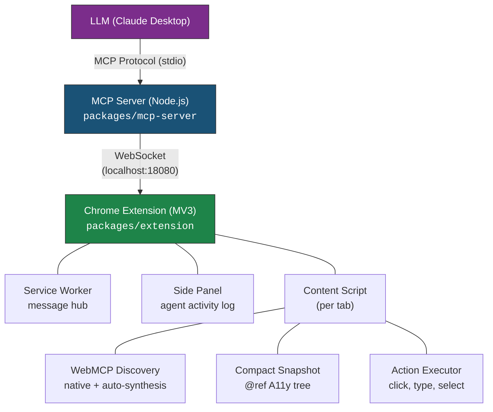

# WebClaw

[](https://github.com/kuroko1t/webclaw/actions/workflows/ci.yml)
[](https://www.npmjs.com/package/webclaw-mcp)
[](LICENSE)

The first **WebMCP-native** browser agent. Enables AI assistants like Claude to interact with web pages through a Chrome extension and MCP server.

## What is WebClaw?

WebClaw bridges AI assistants and the browser using two approaches:

1. **WebMCP Native** - Discovers and invokes tools declared by websites via the W3C `navigator.modelContext` API (Chrome 146+)
2. **DOM Fallback** - Automatically synthesizes tools from forms, buttons, and inputs on any website, plus provides compact accessibility tree snapshots with `@ref` labels for precise element targeting

Unlike CDP-based alternatives (browser-use, Playwright MCP), WebClaw runs inside a **real Chrome extension** — meaning it has access to the user's logged-in sessions, cookies, and installed extensions, and is **resistant to bot detection**.

## Architecture



## MCP Tools

### Page Interaction

| Tool | Parameters | Description |
|------|-----------|-------------|
| `navigate_to` | `url`, `tabId?` | Navigate to a URL |
| `page_snapshot` | `maxTokens?`, `tabId?` | Get a compact accessibility tree with `@ref` labels |
| `click` | `ref`, `snapshotId`, `tabId?` | Click an element by its `@ref` label |
| `type_text` | `ref`, `text`, `snapshotId`, `tabId?` | Type text into an input/textarea by `@ref` |
| `select_option` | `ref`, `value`, `snapshotId`, `tabId?` | Select a dropdown option by `@ref` |
| `screenshot` | `tabId?` | Capture the visible area of the active tab |

### Tab Management

| Tool | Parameters | Description |
|------|-----------|-------------|
| `new_tab` | `url?` | Open a new tab (optionally with a URL) |
| `list_tabs` | | List all open tabs with tabId, URL, title, and active state |
| `switch_tab` | `tabId` | Switch to a specific tab |
| `close_tab` | `tabId` | Close a specific tab |

### Navigation

| Tool | Parameters | Description |
|------|-----------|-------------|
| `go_back` | `tabId?` | Go back to the previous page |
| `go_forward` | `tabId?` | Go forward to the next page |
| `reload` | `tabId?`, `bypassCache?` | Reload the current page |
| `wait_for_navigation` | `tabId?`, `timeoutMs?` | Wait for the page to finish loading |
| `scroll_page` | `direction?`, `amount?`, `ref?`, `snapshotId?`, `tabId?` | Scroll the page or scroll to a specific element |

### WebMCP

| Tool | Parameters | Description |
|------|-----------|-------------|
| `list_webmcp_tools` | `tabId?` | Discover tools on the page (native WebMCP + auto-synthesized from buttons/forms) |
| `invoke_webmcp_tool` | `toolName`, `args?`, `tabId?` | Invoke a discovered tool (native or synthesized) |

## Quick Start

### Prerequisites

- Node.js 20+
- pnpm 9+
- Google Chrome 120+ (Chrome 146+ for native WebMCP)

### 1. Build

```bash
git clone https://github.com/kuroko1t/webclaw.git
cd webclaw
pnpm install
pnpm build
```

### 2. Load Chrome Extension

1. Open `chrome://extensions/`
2. Enable **Developer mode**
3. Click **Load unpacked**
4. Select `packages/extension/dist/`

### 3. Configure your MCP Client

<details>
<summary><b>Claude Desktop</b></summary>

Add to your `claude_desktop_config.json`:

```json
{
  "mcpServers": {
    "webclaw": {
      "command": "npx",
      "args": ["-y", "webclaw-mcp"]
    }
  }
}
```

Config file locations:
- macOS: `~/Library/Application Support/Claude/claude_desktop_config.json`
- Linux: `~/.config/Claude/claude_desktop_config.json`
- Windows: `%APPDATA%\Claude\claude_desktop_config.json`

</details>

<details>
<summary><b>Claude Code</b></summary>

```bash
claude mcp add webclaw -- npx -y webclaw-mcp
```

</details>

<details>
<summary><b>Cursor</b></summary>

Add to `.cursor/mcp.json` in your project root:

```json
{
  "mcpServers": {
    "webclaw": {
      "command": "npx",
      "args": ["-y", "webclaw-mcp"]
    }
  }
}
```

</details>

<details>
<summary><b>VS Code (Copilot)</b></summary>

Add to `.vscode/mcp.json` in your project root:

```json
{
  "servers": {
    "webclaw": {
      "type": "stdio",
      "command": "npx",
      "args": ["-y", "webclaw-mcp"]
    }
  }
}
```

</details>

<details>
<summary><b>Windsurf</b></summary>

Add to `~/.codeium/windsurf/mcp_config.json`:

```json
{
  "mcpServers": {
    "webclaw": {
      "command": "npx",
      "args": ["-y", "webclaw-mcp"]
    }
  }
}
```

</details>

### 4. Verify

Restart your MCP client and ask the AI to navigate to a website. Chrome will be **launched automatically** when a tool is called — no need to start it manually. You should see activity in the extension's Side Panel.

### Environment Variables

| Variable | Default | Description |
|----------|---------|-------------|
| `WEBCLAW_PORT` | `18080` | WebSocket port for MCP server ↔ extension communication |

## Demo

Ask your AI assistant: **"Go to Wikipedia and search for WebMCP"**

The AI uses WebClaw's MCP tools to interact with the browser step-by-step:

```
1. navigate_to("https://en.wikipedia.org")
2. page_snapshot()                          → get the @ref tree (see below)
3. type_text(@e3, "WebMCP")                 → type into search box
4. click(@e4)                               → click Search button
```

### `page_snapshot` output — compact accessibility tree with `@ref` labels

```
[page "Wikipedia, the free encyclopedia"]
  [banner]
    [search]
      [form]
        [@e3 searchbox "Search Wikipedia"]    ← AI targets this by @ref
        [@e4 button "Search"]                 ← and clicks this
    [nav "Personal tools"]
      [@e5 link "Donate"]
      [@e6 link "Create account"]
      [@e7 link "Log in"]
  [main]
    [heading[1] "Welcome to Wikipedia"]
    [group]
      [heading[2] "From today's featured article"]
      ...
```

Every interactive element gets a stable `@ref` label. The AI reads the tree, picks the right `@ref`, and calls `click` / `type_text` / `select_option` — no pixel coordinates, no fragile CSS selectors, no screenshots needed for navigation.

The Side Panel shows all tool calls in real-time.

## Demo Site

A WebMCP-enabled Todo app is included for testing native tool discovery:

```bash
cd examples/webmcp-demo-site
npx serve .
```

Open `http://localhost:3000` in Chrome, then ask Claude to interact with the todo list. It will discover the native `add_todo`, `toggle_todo`, `delete_todo`, and `list_todos` tools via WebMCP.

## How It Differs from Alternatives

| | WebClaw | browser-use | Playwright MCP |
|---|---|---|---|
| WebMCP native | Yes | No | No |
| Uses real browser | Yes (extension) | No (CDP) | No (Playwright) |
| Bot detection | Resistant | Vulnerable | Vulnerable |
| User's session | Yes | No | No |
| Page snapshots | `@ref` A11y tree | Screenshots | DOM/Screenshots |

## Development

```bash
pnpm install
pnpm build        # Build all packages
pnpm test         # Run all tests
pnpm dev          # Watch mode
```

### Project Structure

```
packages/
  shared/          Type definitions, Zod schemas, utilities
  mcp-server/      MCP server with 17 tools, WebSocket bridge
  extension/       Chrome MV3 extension (service worker, content scripts, side panel)
examples/
  webmcp-demo-site/  WebMCP-enabled Todo app for testing
```

## Troubleshooting

**Chrome extension not connected**
- Chrome is auto-launched when a tool is called. If it fails, start Chrome manually with the extension loaded
- Check the Service Worker console (`chrome://extensions/` → Details → Service Worker) for `Connected to MCP server`
- Verify the MCP server is running (look for `WebSocket server listening on 127.0.0.1:18080` in stderr)
- Chrome is only launched once per MCP session to prevent multiple instances

**MCP client cannot connect**
- Ensure `npx webclaw-mcp` runs successfully from your terminal
- Check for port conflicts on 18080 (override with `WEBCLAW_PORT` env var)
- Restart your MCP client after updating the config

**Content script not injecting**
- Content scripts only inject into `http://` and `https://` pages (not `chrome://`, `file://`, etc.)
- Try refreshing the page after loading the extension

**WebMCP tools not discovered**
- Native WebMCP requires Chrome 146+ with the `navigator.modelContext` API
- Verify the page declares tools via `navigator.modelContext.addTool()` or `<link rel="webmcp-manifest">`

## Contributing

Contributions are welcome! Please open an issue to discuss your idea before submitting a pull request.

```bash
git clone https://github.com/kuroko1t/webclaw.git
cd webclaw
pnpm install
pnpm build
pnpm test         # Run all tests before submitting
```

## License

[MIT](LICENSE)
